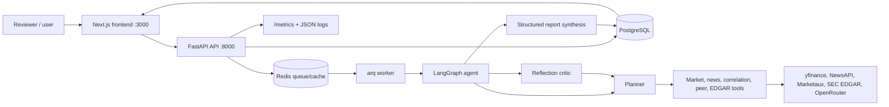

# M.I.R.A. - Market Intelligence & Research Agent

M.I.R.A. is a runnable autonomous equity-research agent built for the Uniparticle Engineering Assessment (CS-001 Rev. B). It accepts a natural-language stock question, plans research, calls market/news/correlation tools, reflects when evidence is weak, and returns a structured investment report.

## Reviewer Quick Start

This project is more than the minimum backend. The submission includes a FastAPI agent service, Redis worker queue, PostgreSQL persistence, Alembic migrations, Redis caching, a Next.js review UI, observability, model benchmarking, tests, and Docker deployment.

### Tools Implemented

| Tool | Required? | What it does | Code |
|---|---:|---|---|
| Market data | Yes | price, daily change, volume, market cap, P/E, 52-week range, last two quarterly revenues via yfinance | `backend/app/tools/market_data.py` |
| News + sentiment | Yes | 5 recent articles, per-article sentiment, positive/negative/neutral distribution via NewsAPI, Marketaux, and LLM classification | `backend/app/tools/news_sentiment.py` |
| Peer / market correlation | Yes | Pearson correlations vs S&P 500, sector ETF, and peers | `backend/app/tools/correlation.py` |
| Peer fundamentals | Yes, mock-style | deterministic mock peer financial data as allowed by the brief | `backend/app/tools/peer_fundamentals.py` |
| EDGAR filings | Bonus | recent 10-K / 10-Q / 8-K fallback when news is stale or sentiment is unclear | `backend/app/tools/edgar.py` |
| Peer news | Bonus | competitor news pass when sector correlation is too high | `backend/app/tools/news_sentiment.py` |

### Deliverables Checklist

| Assessment deliverable | Status | Evidence |
|---|---:|---|
| Source code | Done | `backend/`, `frontend/` |
| Runnable backend service | Done | FastAPI app in `backend/app/main.py` |
| `POST /analyze` | Done | `backend/app/api/analyze.py` |
| `GET /status/{job_id}` | Done | `backend/app/api/status.py` |
| Async agent service | Done | Redis + arq worker in `backend/app/workers/jobs.py` |
| Structured JSON report | Done | Pydantic schema in `backend/app/api/schemas.py` |
| 3+ tools with planning | Done | LangGraph planner + tool executor |
| Reflection loop | Done | `backend/app/agent/nodes/reflection_critic.py` |
| Persistent monitoring | Done | `POST /monitor_start`, monitor state table, trigger history |
| Observability + cost controls | Done | structured tool logs, token/cost ledger, `/metrics`, Grafana dashboard |
| Dockerfile | Done | `backend/Dockerfile`, `frontend/Dockerfile` |
| `docker-compose.yml` | Done | Postgres + Redis + API + worker + frontend |
| Dependency manifests | Done | `backend/requirements.txt`, `backend/pyproject.toml`, `frontend/package.json` |
| `.env.example` | Done | all required env vars, no secrets |
| Sample output | Done | `sample_output.json` |
| Postman collection | Done | `postman_collection.json`, mirrored in `docs/postman_collection.json` |
| Test cases + eval discussion | Done | `backend/eval/`, this README |
| LLM benchmark document | Done | `docs/model_benchmark.md`, `docs/model_benchmark.pdf` |

### What Makes The App Strong

M.I.R.A. is practical because it behaves like a production workflow, not a script:

| Capability | Practical value |
|---|---|
| Live job lifecycle | The API returns a job ID immediately, while the frontend streams/polls progress and renders the final report. |
| Durable storage | Jobs, events, monitor targets, tool logs, and LLM cost records live in PostgreSQL. |
| Redis queue + cache | Worker jobs do not block the API; cached upstream responses protect free API limits. |
| Alembic migrations | The database schema is versioned and created on container startup. |
| Reflection triggers | The agent re-plans when correlation is too high, news is stale, or sentiment is too neutral. |
| Monitoring mode | Reviewers can register tickers and see proactive alerts tagged as `PROACTIVE_ALERT`. |
| Cost guardrails | `MAX_TOOL_CALLS`, `MAX_TOKENS_PER_JOB`, per-job token records, and model pricing prevent runaway loops. |
| Reviewer UI | The Next.js app exposes analysis, report views, monitor controls, trigger state, citations, and tool traces. |

## Architecture



### Runtime Flow

1. `POST /analyze` creates a job row and immediately returns `{ "job_id": "...", "status": "queued" }`.
2. Redis/arq runs `analyze_ticker` in the worker.
3. LangGraph executes: ticker extraction -> planning -> tool execution -> reflection -> optional re-plan -> synthesis.
4. The final report is validated against `AnalysisReport` and stored in Postgres.
5. `GET /status/{job_id}` returns status, cost telemetry, and the final report when complete.
6. `POST /monitor_start` persists a ticker monitor and schedules future trigger checks.


START → ticker_extractor → planner → tool_executor → reflection_critic
                              ↑________________________|
                              (replan loop, محدود بـ MAX_REFLECTION_PASSES)
                                                       ↓ (لو خلصنا)
                                                   synthesizer → END
## Technology Choices

| Layer | Choice | Rationale |
|---|---|---|
| API | FastAPI + Pydantic v2 | Async, typed request/response models, OpenAPI docs for free. |
| Agent orchestration | LangGraph | Clean planning/reflection graph with conditional re-plan edges. |
| Worker queue | Redis + arq | Native asyncio queue with low ceremony and deferred jobs for monitors. |
| Database | PostgreSQL via SQLAlchemy async | Durable production-style persistence for jobs, events, monitors, logs, and costs. |
| Migrations | Alembic | Versioned schema, automatically upgraded by `backend/entrypoint.sh`. |
| Cache | Redis TTL cache | Reduces repeated yfinance/news/EDGAR calls and protects free API tiers. |
| LLM provider | OpenRouter | Lets the app benchmark/swap GPT-5.4, Grok 4.3, DeepSeek V4 Pro behind one OpenAI-compatible client. |
| Primary model | `x-ai/grok-4.3` | Selected as the best speed/cost balance in `docs/model_benchmark.md`. |
| Fallback model | `deepseek/deepseek-v4-pro` | Cheapest benchmark-passing fallback. |
| Resilience | `tenacity`, `pybreaker`, singleton `httpx.AsyncClient` | Retries transient failures, opens circuit breakers on sustained upstream outages, reuses HTTP connections. |
| Observability | `structlog`, Prometheus, Grafana dashboard | Inspectable tool calls, job progress, token/cost metrics, and system health. |
| Frontend | Next.js 14 + Tailwind | Reviewer-friendly UI for submitting analyses, watching jobs, viewing reports, and managing monitors. |

## Setup And Run

### Required Secrets

Create `.env` from `.env.example`:

```bash
cp .env.example .env
```

Fill these required values:

| Variable | Needed for | Where to get it |
|---|---|---|
| `OPENROUTER_API_KEY` | LLM planning, reflection, sentiment, synthesis, evaluation | https://openrouter.ai/keys |
| `NEWSAPI_KEY` | recent company news | https://newsapi.org |
| `MARKETAUX_KEY` | financial-news sentiment cross-check | https://www.marketaux.com |

Optional fallback keys:

| Variable | Use |
|---|---|
| `ALPHAVANTAGE_KEY` | secondary market-data fallback |
| `FINNHUB_KEY` | secondary news/fundamentals fallback |

No secrets are committed. `.env` is ignored by `.gitignore`; `.env.example` contains empty placeholders only.

### Recommended Docker Compose Run

```bash
docker compose up --build
```

Services:

| Service | URL / role |
|---|---|
| Frontend | http://localhost:3000 |
| API docs | http://localhost:8000/docs |
| Health | http://localhost:8000/health |
| Metrics | http://localhost:8000/metrics |
| Postgres | durable app database |
| Redis | queue + cache |
| Worker | background analysis + monitoring jobs |

### Single-Container Backend Fallback

The brief asks for a single `docker build` + `docker run` path. This mode uses SQLite and inline background jobs:

```bash
docker build -t mira-backend backend/
docker run --rm -p 8000:8000 \
  -e DATABASE_URL=sqlite+aiosqlite:///./mira.db \
  -e OPENROUTER_API_KEY=$OPENROUTER_API_KEY \
  -e NEWSAPI_KEY=$NEWSAPI_KEY \
  -e MARKETAUX_KEY=$MARKETAUX_KEY \
  mira-backend
```

## How To Use The App

Open http://localhost:3000 after `docker compose up --build`.

1. On the main page, type a natural-language query such as `Analyze the near-term prospects of Tesla, Inc. (TSLA).`
2. Submit it. The UI opens `/jobs/{job_id}` and shows the processing stages.
3. When complete, the report page shows market snapshot, sentiment distribution, correlation analysis, key findings, citations, tools used, token/cost usage, and any reflection triggers.
4. Open `/monitor` to register tickers for persistent monitoring.
5. Add a ticker, optional peers, and a cadence. The app computes 30-day baselines, creates an initial baseline report, and later fires proactive reports when article, price, or volume triggers are met.

API equivalents:

```bash
curl -X POST http://localhost:8000/analyze \
  -H "Content-Type: application/json" \
  -d '{"query":"Analyze Apple Inc. (AAPL)."}'

curl http://localhost:8000/status/<job_id>

curl -X POST http://localhost:8000/monitor_start \
  -H "Content-Type: application/json" \
  -d '{"ticker":"AAPL","cadence_seconds":86400,"peers":["MSFT","GOOGL"]}'
```

The Postman collection at `docs/postman_collection.json` includes example requests and responses for quick reviewer testing.

## Brief Compliance Matrix

### Section 2.A - Backend Architecture

| Requirement | Status | Evidence |
|---|---:|---|
| `POST /analyze` accepts natural-language query | Done | `backend/app/api/analyze.py` |
| Immediate job ID, async execution | Done | API creates job, arq worker runs analysis |
| `GET /status/{job_id}` | Done | `backend/app/api/status.py` |
| Structured output schema | Done | `AnalysisReport` in `backend/app/api/schemas.py` |
| Env-driven config | Done | `backend/app/config.py`, `.env.example` |

### Section 2.B - Agentic Behavior

| Requirement | Status | Evidence |
|---|---:|---|
| Multi-step planning | Done | `backend/app/agent/nodes/planner.py` |
| Function-calling-style tool dispatch | Done | tool schemas + `tool_executor.py` |
| Market data tool | Done | `market_data.py` |
| News + sentiment tool | Done | `news_sentiment.py` |
| Peer/correlation tool | Done | `correlation.py`, `peer_fundamentals.py` |
| Sentiment trade-off documented | Done | section below |

### Section 2.C - Output Structure

The final report includes all required fields:

`company_ticker`, `company_name`, `analysis_summary`, `sentiment_score`, `market_snapshot`, `correlation_analysis`, `key_findings`, `tools_used`, `citation_sources`, `generated_at`.

Extra production fields include `degraded`, `degradation_reason`, `reflection_passes`, `triggers_fired`, `confidence`, `data_freshness`, `sentiment_distribution`, `token_usage`, `tool_invocations`, `alert_tag`, `monitor_trigger`, and `extended_analysis`.

### Section 3.A - Dynamic Reflection

| Trigger from brief | Implemented behavior |
|---|---|
| Sector ETF correlation > 0.95 | Adds peer news and peer fundamentals before synthesis. |
| All news older than 72 hours | Adds EDGAR filings as alternative recent context. |
| Neutral or evenly split sentiment | Adds EDGAR filings for more context. |
| Avoid runaway loops | `MAX_REFLECTION_PASSES` caps reflection passes. |

### Section 3.B - Persistent Monitoring

| Requirement | Status |
|---|---:|
| `POST /monitor_start` | Done |
| configurable cadence, default 24h | Done |
| trading-day awareness | Done |
| >= 5 new articles trigger | Done |
| price > 2 standard deviations trigger | Done |
| volume > 2x average trigger | Done |
| `PROACTIVE_ALERT` tag | Done |
| persisted monitor state across restarts | Done |

### Section 3.C - Observability And Cost Controls

| Requirement | Status | Evidence |
|---|---:|---|
| per-tool structured logs | Done | `tool_invocations` table + SSE events |
| token usage per job | Done | `llm_calls` and job token totals |
| estimated cost | Done | `backend/app/llm/pricing.yaml` |
| max tool-call budget | Done | `MAX_TOOL_CALLS`, `JobBudget` |
| production metrics | Bonus | `/metrics`, Grafana JSON dashboard |

### Section 3.D - Evaluation

The repo includes more than the three required documented cases:

| Evaluation artifact | Contents |
|---|---|
| `backend/eval/golden_cases.yaml` | 6 cases: AAPL, unknown ticker, delisted LEHMQ, TSLA, KO, MSFT |
| `backend/eval/run_eval.py` | runs golden cases against the real agent |
| `backend/eval/judge.py` | LLM-as-judge scoring harness |
| `backend/eval/rubric.md` | 5-dimension rubric |
| `docs/model_benchmark.md` | GPT-5.4 vs Grok 4.3 vs DeepSeek V4 Pro results |
| `backend/tests/` | pytest suite for schemas, reflection, monitoring triggers, persistence, budgets, dedupe, backpressure, degraded tools |
| `frontend/e2e/` | Playwright tests for analyze and monitor UI flows |

## Run Tests And Evaluation

```bash
make test
make lint
make typecheck
make eval
```

Useful details:

| Command | Purpose |
|---|---|
| `make test` | pytest suite with in-memory SQLite and mocked external calls |
| `make eval` | golden cases against the real agent; requires API keys |
| `cd backend && python -m eval.run_model_benchmark` | regenerates `docs/model_benchmark.md` and `docs/model_benchmark.pdf` |
| `cd frontend && npm run e2e` | Playwright E2E tests against a running stack |

## LLM Benchmark Summary

Full results live in `docs/model_benchmark.md` and `docs/model_benchmark.pdf`.

| Model | Pass | p50 latency | Total tokens | Total cost |
|---|---:|---:|---:|---:|
| GPT-5.4 | 3/3 | 2.8s | 1,071 | $0.00969 |
| Grok 4.3 | 3/3 | 6.21s | 2,914 | $0.00605 |
| DeepSeek V4 Pro | 3/3 | 16.42s | 1,827 | $0.00123 |

Grok 4.3 is configured as the primary model because it passed all tasks while staying cheaper than GPT-5.4. DeepSeek V4 Pro is the fallback because it passed all tasks at the lowest cost, with higher latency.

## Evaluation Discussion

Agent quality should be measured in layers because one metric will miss important failures.

1. Structural regression tests should run on every PR. The included pytest suite validates schema invariants such as exactly three key findings, sentiment score between -1 and 1, alert tag propagation, reflection trigger behavior, budget enforcement, and durable event handling.
2. Golden cases should run regularly against the real agent. The included cases cover normal tickers, unknown tickers, a delisted ticker, idiosyncratic vs sector-correlated names, and basic Microsoft/Apple sanity checks.
3. LLM-as-judge scoring can measure factuality, citation quality, actionability, sentiment plausibility, and schema compliance. The included rubric is useful, but a production judge should ideally use a different model family than the agent to reduce shared blind spots.
4. Ground-truth replay should compare agent outputs against known historical events such as earnings beats, guidance cuts, major regulatory news, or executive departures. Tool responses can be frozen at the event date, then the report can be scored against the actual market reaction.
5. Sentiment back-testing should measure whether article-level and report-level sentiment have any predictive or explanatory relationship with same-day or next-week returns over a large ticker set. The expected signal is small, but it should not be zero.
6. Production drift monitoring should track distributions of sentiment scores, reflection passes, tool failures, empty citations, cost per job, and trigger rates. Sudden changes usually mean an upstream API changed, a model regressed, or prompts need adjustment.
7. Cross-model A/B runs should compare the same query across primary and fallback models. Agreement increases confidence; repeated disagreement points to prompts, tools, or model selection that need work.

## Sentiment Trade-Off

| Approach | Pros | Cons | Decision |
|---|---|---|---|
| LLM sentiment | Handles financial language, explains reasoning, avoids local ML image bloat | Costs tokens and has variable latency | Primary |
| Marketaux sentiment | Fast external financial-news signal | Only available for indexed articles and is a black box | Cross-check |
| FinBERT | Finance-tuned and deterministic | Adds large model dependencies and RAM/cold-start cost | Not used |
| VADER | Tiny and fast | Weak on finance-specific wording | Not used |

The implemented approach uses LLM sentiment as primary and Marketaux as a cross-check. If they diverge materially, the final report lowers confidence.

## Known Limitations

- `yfinance` is unofficial and can break or rate-limit. A paid provider such as Polygon or IEX Cloud would be stronger in production.
- `peer_fundamentals` intentionally uses deterministic mock data because the brief allows a simulated API call for that tool.
- LLM sentiment can misread niche financial phrasing; FinBERT would improve determinism but would significantly increase image size and runtime memory.
- Free-tier news APIs may return sparse coverage for small-cap or delisted companies.
- Monitoring baselines are recomputed in-process. A high-volume production fleet should precompute and store baselines.
- Sector ETF mapping is static. A production system should derive it from a taxonomy/reference-data service.
- LLM-as-judge is useful but not ground truth and should be paired with historical replay and human review.
- Single-container SQLite mode is convenient for the brief, but Docker Compose with Postgres and Redis is the production-shaped path.

## Project Structure

```text
.
|-- backend/
|   |-- app/
|   |   |-- api/              # analyze, status, monitor, ops routes
|   |   |-- agent/            # LangGraph state, planner, tools, reflection, synthesis
|   |   |-- tools/            # market, news, correlation, EDGAR, peer tools
|   |   |-- persistence/      # SQLAlchemy models and repositories
|   |   |-- workers/          # arq background jobs
|   |   |-- monitoring/       # baselines and trigger logic
|   |   |-- llm/              # OpenRouter client, budget, pricing
|   |   `-- observability/    # logs, metrics, rate limits
|   |-- alembic/              # migrations
|   |-- eval/                 # golden cases, judge, model benchmark
|   `-- tests/                # pytest suite
|-- frontend/                 # Next.js reviewer UI
|-- docs/                     # benchmark, monitoring notes, Postman collection
|-- observability/grafana/    # Grafana dashboard JSON
|-- docker-compose.yml
|-- sample_output.json
|-- postman_collection.json
`-- README.md
```
