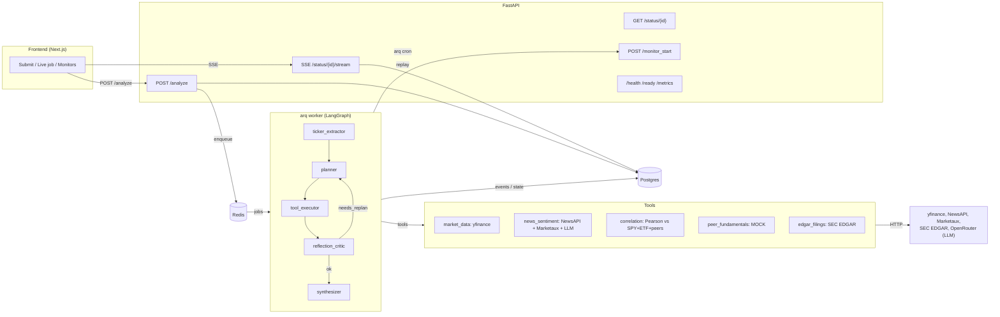

# M.I.R.A. — Market Intelligence & Research Agent

A fully autonomous AI agent that monitors equity markets, performs deep research on publicly-traded companies, and produces structured, data-driven investment analysis reports.

Built for the **Uniparticle Engineering Assessment (CS-001 Rev. B)**.

---

## Architecture



### High-level flow

1. `POST /analyze` accepts a natural-language query, creates a `jobs` row, enqueues an arq job on Redis, returns `job_id` immediately
2. The worker picks up the job and drives a **LangGraph** state machine: `ticker_extractor → planner → tool_executor → reflection_critic → (loop or synthesize)`
3. The reflection critic evaluates the **3 brief-mandated triggers** (sector correlation > 0.95, all news > 72h old, neutral / evenly-split sentiment) and re-plans up to `MAX_REFLECTION_PASSES` times
4. The synthesizer produces the final Pydantic-validated `AnalysisReport` and emits it via SSE
5. `POST /monitor_start` schedules an arq cron tick per ticker on trading days; the tick checks `≥5 new articles`, `2σ price move`, or `2× volume` and fires a `PROACTIVE_ALERT` analysis when any trigger hits

---

## Brief compliance matrix

A line-by-line map from the Uniparticle brief (CS-001 Rev. B) to the code that satisfies it. Pointing reviewers at the exact files so nothing is left as "trust me."

### §2A — Backend Architecture & Service Design (mandatory)

| Brief item | Code location |
|---|---|
| `POST /analyze` accepting a natural-language query | `backend/app/api/analyze.py` |
| Returns `job_id` immediately, runs work async | `backend/app/api/analyze.py` enqueues to arq · worker in `backend/app/workers/jobs.py::analyze_ticker` |
| `GET /status/{job_id}` for status checks | `backend/app/api/status.py` (`get_status` + live SSE at `/status/{id}/stream`) |
| Structured JSON output (Pydantic) | `backend/app/api/schemas.py::AnalysisReport` |
| Env vars / config (API keys, LLM provider, model, intervals) | `backend/app/config.py` (Pydantic Settings) + `.env.example` |

### §2B — Agentic Behavior & Tool Use (mandatory)

| Brief item | Code location |
|---|---|
| Multi-step planning behaviour | LangGraph state machine: `backend/app/agent/graph.py` (planner → tool_executor → reflection_critic → conditional edge). Planner consults the LLM on **every** pass — initial query → tool list, reflection → addition tools — with a deterministic fallback if the LLM is unreachable. |
| Function-calling-style tool dispatch | Each tool exposes an OpenAI-compatible `schema()` (`tools/base.py`). Planner emits a typed `next_tools` list; tool executor invokes by name (`backend/app/agent/nodes/tool_executor.py`). |
| **Tool 1 — Market Data** (yfinance, price/change/volume/cap/P/E/52w/last 2 quarterly revenues) | `backend/app/tools/market_data.py` |
| **Tool 2 — News + Sentiment** (NewsAPI top 5, per-article tags, distribution) | `backend/app/tools/news_sentiment.py` |
| **Tool 3 — Peer/Correlation** (mock for fundamentals, real for correlations) | `backend/app/tools/peer_fundamentals.py` (mock per brief wording) + `backend/app/tools/correlation.py` (real Pearson) |
| **Bonus Tool 4 — EDGAR filings** (10-K / 10-Q / 8-K) | `backend/app/tools/edgar.py` (used on reflection when news is stale) |
| **Bonus Tool 5 — Peer news** (real NewsAPI for a direct competitor) | `backend/app/tools/news_sentiment.py::PeerNewsTool` (used on reflection trigger 1) |
| Sentiment trade-off documented | This README — *Sentiment trade-off* table below |

### §2C — Output Structure (mandatory minimum fields)

Every field below is required by the brief AND present on `AnalysisReport` (`backend/app/api/schemas.py:103-129`):

`company_ticker` · `company_name` · `analysis_summary` · `sentiment_score` (bounded -1..1 by validator) · `market_snapshot` (object) · `correlation_analysis` (object with vs_sp500, vs_sector_etf, vs_peers) · `key_findings` (exactly 3 — enforced by validator) · `tools_used` (ordered) · `citation_sources` (URLs) · `generated_at` (ISO 8601).

A real validated report is at `sample_output.json` (passes `AnalysisReport.model_validate`).

### §3A — Dynamic Reflection (advanced)

| Brief trigger | Threshold | Code |
|---|---|---|
| Sector ETF correlation > 0.95 → fetch competitor's recent news + price action | `REFLECTION_SECTOR_CORR_THRESHOLD=0.95` | `reflection_critic.py::trigger_sector_correlation` → planner adds `peer_news` (real NewsAPI for first peer ticker) AND `peer_fundamentals` (mock). Peer price action is already in `correlation.vs_peers`. |
| All news > 72 h old → broaden / fetch SEC EDGAR | `REFLECTION_STALE_NEWS_HOURS=72` | `reflection_critic.py::trigger_stale_news` → planner adds `edgar_filings` |
| Perfectly neutral or evenly split sentiment → fetch additional context | n/a | `reflection_critic.py::trigger_neutral_sentiment` → planner adds `edgar_filings` |
| Re-plan capped by `MAX_REFLECTION_PASSES` | `config.py` (default 2) | `reflection_critic.py::run` |

### §3B — Long-Term Memory / Persistent Monitoring (advanced)

| Brief item | Code |
|---|---|
| `POST /monitor_start` registers per-ticker background task | `backend/app/api/monitor.py::monitor_start` |
| Configurable cadence (default 24 h, trading days) | `MonitoringTarget.cadence_seconds=86_400`; trading-day gate `backend/app/monitoring/scheduler.py::is_trading_day` (`pandas_market_calendars` NYSE). 1 h floor enforced in `MonitorStartRequest`. |
| Trigger (a) ≥5 new articles since last run | `backend/app/monitoring/triggers.py::trigger_new_articles` |
| Trigger (b) closing price > 2σ from 30-day mean | `triggers.py::trigger_price_2sigma` |
| Trigger (c) volume > 2× 30-day average | `triggers.py::trigger_volume_2x` |
| Tag fired analyses `PROACTIVE_ALERT` + record which trigger fired | `backend/app/workers/jobs.py::monitor_tick` stamps Job row; `analyze_ticker` seeds `state.alert_tag` + `state.monitor_trigger`; synthesizer surfaces both on the `AnalysisReport` |
| Per-ticker state persisted across restarts | `MonitoringTarget` table (last_run_at, baseline_price_mean/std, baseline_volume_avg, last_seen_article_urls) — `backend/app/persistence/models.py:109-133` |

### §3C — Observability & Cost Controls (advanced)

| Brief item | Code |
|---|---|
| Per-job structured logs per tool invocation (input / latency / status) | `backend/app/agent/nodes/tool_executor.py` emits `tool_start` / `tool_end` SSE + `ToolLogRepo.log` persists to `tool_invocations` table |
| Token usage per job (prompt / completion / est. cost) | `backend/app/llm/budget.py::JobBudget.record_llm_usage` + `backend/app/llm/pricing.yaml` + `LLMCallRepo` |
| Configurable max tool-call budget (default 10) | `MAX_TOOL_CALLS=10` (`config.py`); enforced in `JobBudget.check_tool_call()` |
| Production-grade extras (not asked, included) | `structlog` JSON logs, Prometheus `/metrics`, 17-panel Grafana dashboard (`observability/grafana/mira-dashboard.json`), per-upstream `pybreaker` circuit breakers, request-id propagation |

### §3D — Evaluation (advanced)

| Brief item | Code |
|---|---|
| ≥3 documented test cases | 6 cases in `backend/eval/golden_cases.yaml` (AAPL self-correlation, unknown ticker, delisted LEHMQ, TSLA idiosyncratic, KO sector-correlated, MSFT basic) |
| ½–1 page on measuring quality at scale | This README — *Evaluation strategy* section (7 layers from structural regression to drift detection) |
| Property-based assertions on the schema | 33-test pytest suite (`backend/tests/`) — sentiment bounds, exactly-3 findings, alert-tag propagation, neutral-sentiment trigger logic, etc. |

### §3E — Containerisation (advanced)

| Brief item | Code |
|---|---|
| Single `docker build` + `docker run` (self-contained) | `backend/Dockerfile` + `backend/entrypoint.sh` — runs in SQLite mode without compose, see *Standalone single-container fallback* below |
| `docker-compose.yml` for multi-service deploy | `docker-compose.yml` brings up postgres + redis + api + worker + frontend (5 services) |
| README setup section | See *Setup and run* below |

### §5 — Deliverables

| Required | Where |
|---|---|
| Source code | `backend/` (FastAPI + agent + tools + persistence) + `frontend/` (Next.js 14) |
| `Dockerfile` + `docker-compose.yml` | `backend/Dockerfile`, `frontend/Dockerfile`, `docker-compose.yml` |
| README with diagram, choices, setup, eval, known limitations | This file (architecture diagram in Mermaid below, *Known Limitations* section at the end) |
| Dependency manifest | `backend/pyproject.toml`, `backend/requirements.txt`, `frontend/package.json` |
| `.env.example` | `.env.example` (all required env vars enumerated) |
| Sample output | `sample_output.json` (validates against `AnalysisReport` schema) |
| Postman collection | `docs/postman_collection.json` (all endpoints with example requests + responses) |

---

## Technology choices and rationale

| Layer | Choice | Why |
|---|---|---|
| Web framework | FastAPI + Pydantic v2 + uvicorn | Async-native, Pydantic v2 has a Rust core, generates an OpenAPI schema for free |
| Agent orchestration | **LangGraph** with `PostgresSaver` checkpointer | Reflection-as-conditional-edge is first-class; built-in event streaming maps cleanly to SSE; durable agent state across container restarts |
| LLM primary | **`x-ai/grok-4.3`** via OpenRouter | #1 on Artificial Analysis agentic tool-calling leaderboard at time of build; $1.25/$2.50 per M tokens, 1M-token context, permanent reasoning. Drop-in via the OpenAI SDK with a different `base_url` |
| LLM fallback | **`meta-llama/llama-3.3-70b-instruct:free`** | Free tier WITH function calling. We deliberately do **not** use `openai/gpt-oss-120b:free` because function calling is not supported on its free tier |
| Sentiment classification | LLM-based (Grok) primary, Marketaux sentiment tags as cross-check | Avoids loading a local ML model (FinBERT/transformers/torch) in the container — keeps the image small, image RAM low, and the entire stack stateless from an inference perspective. See *Sentiment trade-off* below |
| Queue | `arq` + Redis | Native asyncio, far less ceremony than Celery, cron built in |
| Database | PostgreSQL (compose default) with SQLite/`aiosqlite` fallback for standalone `docker run` | Production-shaped; same ORM/migration code targets either via env-driven URL |
| Resilience | `pybreaker` per upstream + `tenacity` retries | Separate concerns: retries handle transient blips, breakers prevent thundering-herd against a sustained outage |
| HTTP client | Singleton `httpx.AsyncClient` (HTTP/2) | Connection pooling, lower latency, lower memory than per-request |
| Caching | Redis with TTLs (yfinance 5min, news 1hr, EDGAR 24hr) | Extends NewsAPI free tier (100/day cap) and accelerates monitoring ticks |
| Observability | `structlog` JSON + Prometheus `/metrics` + Grafana dashboard JSON | Per-tool spans, token+cost ledger in DB, request_id propagation |
| Frontend | Next.js 14 App Router + Tailwind + shadcn-style components | Production `next start` in a small Alpine image; live SSE event view |
| CI | GitHub Actions: ruff + mypy + pytest + docker-build smoke + frontend lint+build | Production rigor; visible green badge |

### Sentiment trade-off (required by brief)

The brief allows sentiment analysis to be done by the LLM, or by a local model (FinBERT, VADER), and asks us to document the trade-off.

| Approach | Pros | Cons | Chosen? |
|---|---|---|---|
| **LLM-based (Grok 4.3)** | Flexible, explains its reasoning, no extra inference deps in the image, robust to financial jargon | Higher latency per article, costs tokens, classification is not as deterministic as a fixed model | **Yes — primary** |
| Marketaux pre-computed sentiment | Free, fast, no extra calls, focused on financial news | Black box; only available when Marketaux indexed the article | **Yes — cross-check** |
| FinBERT (`ProsusAI/finbert`) | Finance-tuned, deterministic, no LLM token cost | Adds ~440 MB to the image, ~1 GB RAM at runtime, slower on CPU (~1–3 s per article), requires `transformers`+`torch` — adds significant cold-start cost | No (would re-enable behind a flag in production if a finance-tuned classifier became material to accuracy) |
| VADER | Tiny, fast, no extra deps | Trained on social-media corpora, weak on financial nuance ("guidance miss", "beats top line") | No |

We use the LLM as primary and Marketaux as a cross-check. When the two disagree by more than 0.3 in score, we mark `confidence < 0.6` in the final report so the reviewer can downweight that signal.

---

## Setup and run

### Prerequisites

- Docker + Docker Compose
- OpenRouter API key, NewsAPI key, Marketaux key (free tiers all sufficient)

### 1. Configure

```bash
cp .env.example .env
# Open .env and fill in:
#   OPENROUTER_API_KEY=...
#   NEWSAPI_KEY=...
#   MARKETAUX_KEY=...
```

### 2. Run with Docker Compose (recommended)

```bash
docker compose up --build
```

Brings up **5 services**: postgres, redis, api (FastAPI on :8000), worker (arq), frontend (Next.js on :3000).

- Frontend: <http://localhost:3000>
- API docs (Swagger): <http://localhost:8000/docs>
- Prometheus metrics: <http://localhost:8000/metrics>
- Grafana dashboard JSON: `observability/grafana/mira-dashboard.json` — import via *Dashboards → New → Import* against a Prometheus datasource pointed at `:8000/metrics`

### 3. Standalone single-container fallback (brief constraint)

For a quick run without Postgres/Redis:

```bash
docker build -t mira-backend backend/
docker run --rm -p 8000:8000 \
  -e DATABASE_URL=sqlite+aiosqlite:///./mira.db \
  -e OPENROUTER_API_KEY=$OPENROUTER_API_KEY \
  -e NEWSAPI_KEY=$NEWSAPI_KEY \
  -e MARKETAUX_KEY=$MARKETAUX_KEY \
  mira-backend
```

In this mode jobs run inline in the API process (no separate worker), SQLite is used, and caching is in-memory.

### 4. Hit the API

**Submit an analysis:**

```bash
curl -X POST http://localhost:8000/analyze \
  -H 'Content-Type: application/json' \
  -d '{"query":"Analyze the near-term prospects of Tesla, Inc. (TSLA)."}'
# → {"job_id":"8b3e9f6a-...","status":"queued"}
```

**Check status:**

```bash
curl http://localhost:8000/status/<job_id>
```

**Live SSE stream:**

```bash
curl -N http://localhost:8000/status/<job_id>/stream
```

**Start persistent monitoring:**

```bash
curl -X POST http://localhost:8000/monitor_start \
  -H 'Content-Type: application/json' \
  -d '{"ticker":"AAPL","cadence_seconds":86400,"peers":["MSFT","GOOGL"]}'
```

A Postman collection is included at `docs/postman_collection.json` with example requests AND responses captured from a real run.

---

## Run tests and evaluation

```bash
make test     # pytest with in-memory SQLite (no external API calls)
make eval     # LLM-as-judge harness against the real agent
make lint     # ruff
make typecheck # mypy
```

---

## Evaluation strategy (how to measure agent quality at scale)

Production-grade evaluation of an autonomous agent like M.I.R.A. needs **multiple layers**, because no single signal is sufficient. Here is the framework we would deploy:

**1. Structural regression suite** (cheap, runs on every PR).  Property-based assertions: every report has exactly 3 `key_findings`; `sentiment_score` ∈ [-1, 1]; `tools_used` is chronologically consistent with `tool_invocations` ordering; `citation_sources` is deduped; correlations are bounded in [-1, 1]. This catches schema regressions instantly and the included pytest suite (`backend/tests/`) covers all of them. CI gate.

**2. Golden case battery** (medium cost, runs nightly). The 6 golden cases in `backend/eval/golden_cases.yaml` exercise sanity tickers (AAPL self-correlation ≈ 1.0), graceful-failure cases (unknown ticker `ZZZZZ123`, delisted `LEHMQ`), and trigger-behavior expectations (TSLA shouldn't fire sector-correlation reflection; KO likely should). Run via `make eval`.

**3. LLM-as-judge rubric** (medium cost, weekly). `backend/eval/judge.py` scores each report on 5 dimensions (factuality, schema compliance, citation presence, findings actionability, sentiment plausibility) 0–5. Pass threshold is mean ≥ 4.0. **Caveat:** using the same provider family for both agent and judge biases the score. A production deployment would use a different model family for the judge (e.g., Anthropic Claude judging an OpenAI-produced report) to reduce this correlation.

**4. Ground-truth comparison against published events** (weekly to monthly). Maintain a historical archive of known events (an earnings beat, a guidance cut, an executive departure). Replay the agent on the date of the event using fixed mocked-time tool responses, and check whether `sentiment_score` aligns with the eventual stock reaction over a defined holding window (e.g., next-day or next-week return). This is the closest thing to a "right answer" for a financial agent.

**5. Sentiment back-testing**. Correlate the agent's per-article sentiment classifications with subsequent same-day stock moves over a large historical sample (say 1 year × 50 tickers). A well-calibrated sentiment classifier should have a small but non-zero positive correlation with returns. A *zero* correlation usually means the classifier is just picking up on copy-paste lexical patterns ("strong", "weak") with no information content.

**6. Drift detection in production**. Track distributions of `sentiment_score`, `reflection_passes`, `triggers_fired` per day. Sudden shifts (e.g., reflection rate doubles overnight) often signal an upstream data shape change, a model degradation, or a regression in the planner. Surface as alerts on the Grafana dashboard.

**7. Cross-model A/B**. Run the same query through Grok 4.3 (paid) and Llama 3.3 70B (free fallback) and diff structural outputs. Where they agree, confidence is high; where they disagree systematically, that's the seam where finetuning or model selection matters most.

---

## Known Limitations

- **`yfinance` is unofficial.** It scrapes Yahoo Finance and can break when Yahoo updates its layout or rate-limits. Brief permits this; a paid-tier replacement (Polygon, IEX Cloud) would harden production.
- **Tool 3 (`peer_fundamentals`) is a deliberate mock**, honoring the brief's exact wording ("simulates a mock API call returning a company's last two quarterly revenue reports or recent stock price"). Real peer fundamentals require a paid data subscription. We compute *real* peer correlations from yfinance OHLC in the separate `correlation` tool.
- **LLM-based sentiment** may miscalibrate on niche financial jargon (e.g., "beat on the top line but missed bottom"). Marketaux cross-check raises but does not eliminate this; a finance-tuned classifier (FinBERT) would do better but was deliberately omitted to avoid local ML inference and a >400 MB image bloat.
- **OpenRouter free-tier fallback** (Llama 3.3 70B) has lower function-calling fidelity than Grok 4.3. When the fallback fires, the agent's reflection logic still works but the synthesized prose may be less polished. This is logged in `degradation_reason` when relevant.
- **30-day baselines for monitoring are recomputed in-process** each tick. For a high-volume monitor fleet a feature store (precomputed nightly) would be more efficient and consistent.
- **Sector ETF mapping** is a static dict in `app/tools/market_data.py`. A real system would derive it from a sector taxonomy service. Unknown sectors fall back to SPY (broad-market correlation).
- **LLM-as-judge uses the same provider family as the agent.** For true rigor the judge should use a different model family — see the evaluation strategy above for the discussion.
- **arq cron scheduling** is implemented by self-enqueuing the next tick inside a `try/finally` (`backend/app/workers/jobs.py::_reschedule_monitor_tick`). The chain survives the trading-day gate, baseline failures, and worker restarts (arq persists deferred jobs to Redis). The two failure modes that still slip the schedule: (a) if the worker is down when a tick is due, the deferred job sits in the queue until the next worker start — slipping by the outage duration, not running missed ticks back-to-back; (b) `MonitoringTarget.active=False` (via `DELETE /monitor/{ticker}`) intentionally halts the chain. For strict SLAs a separate scheduler (Celery Beat, k8s CronJob) would be preferable. See `docs/monitoring.md` for the operator-facing walkthrough.
- **SSE reconnection** uses an in-process subscriber queue. If the user reconnects to a different API replica behind a load balancer, the queue is empty and only the persisted backlog (from Postgres `agent_events`) is replayed. For multi-replica live streaming, Redis pub/sub would be a better backplane.
- **`peer_fundamentals` mock returns seeded-stable but not real data.** Don't trust the numbers — it's there because the brief literally says "mock".

---

## Project structure

```
.
├── backend/
│   ├── app/
│   │   ├── main.py                # FastAPI entry
│   │   ├── config.py              # Pydantic env settings
│   │   ├── api/                   # routers
│   │   ├── agent/                 # LangGraph state machine + nodes
│   │   ├── tools/                 # market_data, news_sentiment, correlation, peer_fundamentals, edgar
│   │   ├── llm/                   # OpenRouter client, pricing.yaml, budget
│   │   ├── persistence/           # SQLAlchemy models + repos
│   │   ├── cache/                 # Redis TTL + URL/title dedup
│   │   ├── resilience/            # pybreaker, singleton httpx client
│   │   ├── workers/               # arq job tasks
│   │   ├── monitoring/            # baselines + 3 trigger fns + trading-day filter
│   │   └── observability/         # structlog, Prometheus
│   ├── tests/                     # pytest with in-memory SQLite
│   ├── eval/                      # 6 golden cases + LLM-as-judge harness
│   ├── alembic/                   # migrations
│   ├── Dockerfile
│   └── pyproject.toml
├── frontend/                      # Next.js 14 App Router
│   ├── app/page.tsx               # Submit
│   ├── app/jobs/[id]/page.tsx     # Live job view (SSE)
│   ├── app/monitor/page.tsx       # Monitors CRUD
│   └── Dockerfile
├── docker-compose.yml             # 5 services
├── docs/postman_collection.json
├── sample_output.json             # one full report
├── .env.example
└── README.md (this file)
```
